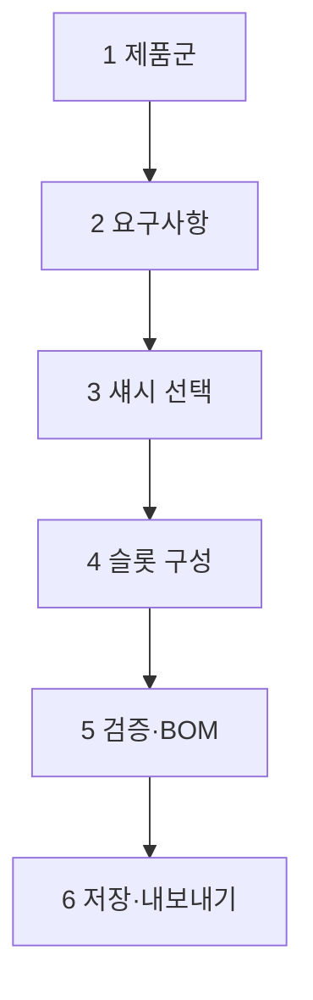
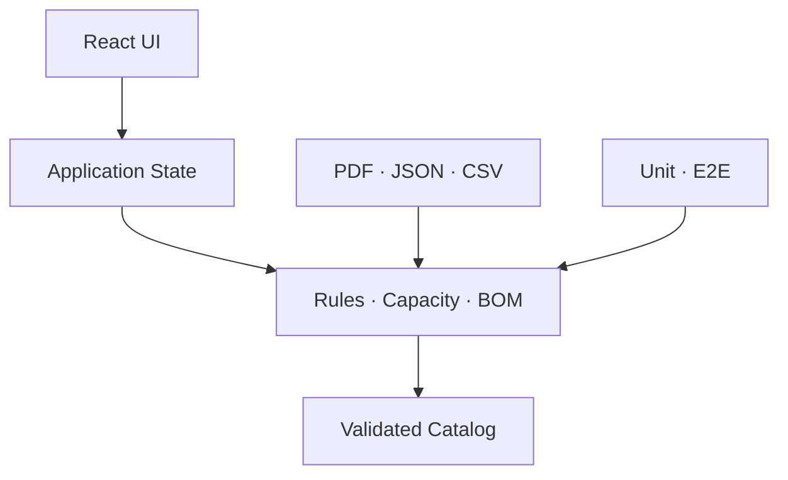

# AI-DLC — RTCOM Matrix I/O Card Configurator

> 문서 상태: Draft v1.0
>
> 작성 기준일: 2026-09-17
>
> 목적: 알티컴(RTCOM) 모듈러 매트릭스의 섀시·입력 카드·출력 카드 구성을 설계하고 검증하며 BOM으로 내보내는 웹 구성기 구현
>
> 실행 방식: AI 개발 에이전트가 본 문서를 기준으로 한 단계씩 조사·설계·구현·검증한다.
>
> 기본 모드: `GUIDED` — 각 PHASE의 Release Gate 통과 후 다음 단계로 이동한다.

---

## 0. AI 실행 지시

당신은 이 프로젝트의 Product Engineer이자 QA Engineer다. 목표는 “그럴듯한 UI”가 아니라 **공식 제품 규칙에 따라 유효한 매트릭스 구성을 생성하는 신뢰 가능한 도구**를 만드는 것이다.

다음 원칙을 항상 지킨다.

1. 먼저 저장소, 공식 사양서, 현재 데이터 구조를 조사한다. 조사 없이 코드를 작성하지 않는다.
2. 제품명, SKU, 슬롯 수, 포트 수, 해상도, 대역폭, 호환성은 추정하지 않는다.
3. 확인되지 않은 값은 `UNKNOWN` 또는 `TBD`로 유지하고 UI의 선택 가능 데이터로 노출하지 않는다.
4. 제품 데이터와 UI 코드를 분리한다. 새 모델·카드는 코드 수정 없이 카탈로그 데이터 추가만으로 등록할 수 있어야 한다.
5. 호환성 판단은 컴포넌트 내부의 조건문이 아니라 독립된 규칙 엔진이 담당한다.
6. 기존 저장소가 있으면 프레임워크, 빌드 방식, 디자인 토큰, 배포 방식을 우선 보존한다.
7. Analog Way의 기능 흐름은 참고하되 디자인, 문구, 이미지, 소스코드, 브랜드 표현을 복제하지 않는다.
8. 한 PHASE에서 요구하지 않은 대규모 리팩터링이나 기능 확장은 하지 않는다.
9. 매 PHASE 종료 시 변경 파일, 검증 결과, 남은 위험, 다음 단계 진입 조건을 보고한다.
10. 오류를 숨기지 않는다. 유효하지 않은 구성은 저장·내보내기 전에 명확히 차단한다.

### 0.1 실행 모드

- `GUIDED`(기본): PHASE 0부터 하나씩 수행하고 Release Gate에서 멈춘다.
- `AUTONOMOUS_MVP`: PHASE 0의 데이터 증거가 충분한 경우에만 PHASE 6까지 연속 수행한다.
- 사용자가 별도로 지시하지 않으면 `GUIDED`로 동작한다.

### 0.2 첫 실행 시 해야 할 일

1. 저장소 루트와 `README`, 패키지 매니저, 빌드·테스트 명령, 배포 설정, 기존 UI 구조를 조사한다.
2. `AGENTS.md`, `CLAUDE.md`, 프로젝트 규칙 파일이 있으면 최우선으로 읽는다.
3. 기존 앱에 통합할지, 독립 앱으로 만들지 저장소 증거로 판단한다.
4. 공식 RTCOM 자료의 가용성을 확인하고 Evidence Ledger를 만든다.
5. PHASE 0 결과를 보고한 뒤, 제품 데이터가 부족하면 필요한 자료만 구체적으로 요청한다.

---

## 1. 프로젝트 정의

### 1.1 문제

모듈러 매트릭스는 섀시마다 사용할 수 있는 입력·출력 슬롯 수와 카드 종류가 다르고, 카드별 포트 수·신호 규격·부가 기능·호환 조건이 존재한다. 이를 수기로 구성하면 다음 문제가 생긴다.

- 잘못된 슬롯에 카드를 배치하거나 허용 수량을 초과할 수 있다.
- 필요한 입력·출력 포트 수를 만족하지 못해도 쉽게 놓칠 수 있다.
- 견적·제안서의 BOM과 화면 구성이 서로 달라질 수 있다.
- 제품 세대가 바뀌면 엑셀·문서·담당자 지식이 서로 어긋난다.
- 같은 조건의 구성을 다시 만들거나 비교하기 어렵다.

### 1.2 제품 비전

사용자가 필요한 신호와 포트 수를 입력하거나 섀시 슬롯을 직접 편집하면, 시스템이 실시간으로 호환성을 검증하고 완성된 구성·포트 합계·BOM·설계 근거를 제공하는 **데이터 주도형 웹 구성기**를 만든다.

### 1.3 주요 사용자

| 사용자 | 주요 목적 | 성공 기준 |
|---|---|---|
| 영업 담당자 | 고객 요구에 맞는 모델과 카드 조합 작성 | 잘못된 조합 없이 빠르게 BOM 생성 |
| 설계·SI 엔지니어 | 신호별 입출력 수량과 호환성 검토 | 구성 근거와 미충족 요구를 즉시 확인 |
| 제품 관리자 | 모델·카드·호환 규칙 유지관리 | 앱 코드를 수정하지 않고 카탈로그 갱신 |
| 고객·파트너 | 권장 구성을 확인하고 공유 | 읽기 쉬운 PDF/링크/JSON으로 재현 가능 |

### 1.4 MVP 범위

- 제품군·섀시 선택
- 목표 입력·출력 요구량 입력(선택 사항)
- 실제 후면 패널과 대응되는 슬롯 편집
- 슬롯 클릭 기반 카드 선택·교체·제거
- 입력/출력/기능별 카드 필터링
- 실시간 호환성·수량·용량 검증
- 포트 합계와 요구 충족률 표시
- 자동 배치 초안 1개 이상 제안
- BOM 생성
- 구성 JSON 저장·불러오기
- 인쇄/PDF용 구성 요약
- 접근성 있는 데스크톱·태블릿 UI

### 1.5 MVP 비범위

- 실제 장비의 라우팅·제어
- RS-232/TCP/IP 명령 전송
- ERP/CRM/견적 시스템 연동
- 확정 판매 가격 및 재고
- 사용자 계정, 결제, 주문
- 이메일 주소 입력을 강제하는 내보내기
- 공식 자료가 없는 모델의 추정 지원

위 항목은 향후 확장 포인트로 설계하되 MVP 구현에는 포함하지 않는다.

---

## 2. 레퍼런스 분석과 독립적 개선 방향

### 2.1 확인된 Analog Way 구성 흐름

공식 Aquilon Configurator는 다음 6단계 진행 표시를 사용한다.

1. Chassis
2. VPU
3. IPU
4. MVR
5. I/O
6. Export

또한 빈 섀시 슬롯을 클릭해 입력·출력 카드를 선택하고, 선택을 확정한 뒤 구성을 PDF로 내보내는 흐름을 제공한다. 이 프로젝트는 해당 **작업 원리**만 참고한다.

참고 링크: [Analog Way Aquilon Configurator](https://www.analogway.com/configurator#product)

### 2.2 RTCOM 공개 정보의 현재 상태

아래 정보는 기획 방향을 잡기 위한 공개 검색 결과이며, 카탈로그 입력 전에 반드시 최신 공식 문서로 다시 검증한다.

| 항목 | 잠정적으로 확인된 내용 | 데이터 사용 상태 |
|---|---|---|
| SPX Series | 슬롯 카드당 8~12포트의 고밀도 구성을 강조한 공개 기사 존재 | `UNVERIFIED` |
| XDM Series | 모듈러 매트릭스 라우터로 소개된 공개 기사 존재 | `UNVERIFIED` |
| UXM Series | 4K@60Hz 4:4:4, HDMI 2.0 지원 문구가 검색 색인에 존재 | `UNVERIFIED` |
| VDM Series | Seamless 및 Video Wall 지원 문구가 검색 색인에 존재 | `UNVERIFIED` |

보조 참고 링크: [AVING의 RTCOM SPX/XDM 소개 기사](https://kr.aving.net/)

> 주의: 현재 RTCOM 공식 사이트는 조사 환경에서 인증서 호스트 불일치로 직접 검증되지 않았다. 위 값은 seed 데이터로 확정하지 않는다.

### 2.3 차별화할 UX

Analog Way의 단방향 마법사보다 다음을 개선 목표로 한다.

- **요구량 우선 모드**: “HDMI 입력 18, HDMI 출력 12”처럼 요구를 먼저 입력하고 가능한 섀시를 추천한다.
- **직접 편집 모드**: 숙련자가 섀시 슬롯을 바로 클릭해 구성한다.
- **설명 가능한 검증**: 단순 Error가 아니라 원인, 영향, 해결 방법을 함께 표시한다.
- **자동 배치**: 최소 섀시, 최소 빈 슬롯, 최소 카드 수 등 목표에 따른 추천안을 제시한다.
- **비교**: 최대 3개 구성을 포트 수·슬롯 사용률·BOM 기준으로 비교한다.
- **재현성**: `catalogVersion`과 `schemaVersion`을 저장해 나중에도 같은 구성을 복원한다.
- **개인정보 없는 내보내기**: MVP에서는 연락처 입력 없이 PDF·JSON·CSV를 생성한다.

---

## 3. 권장 사용자 흐름

### 3.1 기본 6단계



1. **제품군**: SPX/XDM/UXM/VDM 등 검증된 제품군만 노출한다.
2. **요구사항**: 신호 형식, 방향, 포트 수, 필수 기능을 입력한다. 건너뛸 수 있다.
3. **섀시**: 요구를 충족 가능한 모델을 우선순위와 근거와 함께 표시한다.
4. **슬롯 구성**: 섀시 후면 도식에서 슬롯을 선택하고 카드를 배치한다.
5. **검증·BOM**: 오류·경고·충족률·포트 합계·부속품을 확인한다.
6. **저장·내보내기**: JSON, CSV, 인쇄/PDF를 생성한다.

### 3.2 슬롯 편집 상호작용

- 빈 슬롯 선택 → 해당 슬롯에 설치 가능한 카드만 Drawer에 표시
- 카드 선택 → 즉시 임시 배치 → 규칙 엔진 실행 → 결과 표시
- 오류 발생 → 배치는 유지하되 `INVALID` 표시 또는 정책에 따라 적용 차단
- 경고 발생 → 저장 가능, 내보내기 전에 확인 요구
- 카드 선택 상태에서 카드 교체·제거 가능
- `Undo/Redo`, 전체 초기화, 자동 채우기 제공
- 카드 검색은 SKU, 이름, 신호 형식, 커넥터로 가능
- 드래그 앤 드롭은 보조 기능이며 키보드·클릭 방식이 기본 경로다.

### 3.3 화면 레이아웃

| 영역 | 내용 |
|---|---|
| 상단 | 프로젝트명, 저장 상태, 6단계 진행 표시 |
| 좌측 | 제품군/섀시/요구사항 요약 |
| 중앙 | 섀시 후면 도식과 클릭 가능한 물리 슬롯 |
| 우측 | 카드 선택 Drawer 또는 현재 구성 요약 |
| 하단 | 오류·경고·미충족 요구, 다음 단계 버튼 |

화면 폭 1280px 이상을 기본 작업 환경으로 한다. 768~1279px에서는 우측 패널을 Drawer로 전환한다. 모바일에서는 구성 열람·간단 수정만 지원하고 복잡한 다중 슬롯 편집은 데스크톱 사용을 안내할 수 있다.

---

## 4. 정보 구조와 도메인 모델

### 4.1 핵심 엔터티

| 엔터티 | 역할 | 필수 식별자 |
|---|---|---|
| `ProductFamily` | 제품군 | `familyId` |
| `Chassis` | 섀시 모델과 슬롯 구조 | `chassisId`, `sku` |
| `SlotDefinition` | 물리 슬롯 위치와 허용 역할 | `slotId` |
| `Card` | 입력·출력·기능 카드 | `cardId`, `sku` |
| `CompatibilityRule` | 설치·수량·대역폭 규칙 | `ruleId` |
| `RequirementSet` | 사용자가 원하는 입출력 조건 | `requirementSetId` |
| `Configuration` | 특정 카탈로그 버전의 배치 결과 | `configurationId` |
| `ConfigurationItem` | 슬롯과 카드의 결합 | `slotId`, `cardId` |
| `ValidationIssue` | 오류·경고·안내 | `issueCode` |
| `BomLine` | SKU별 수량과 설명 | `sku` |

### 4.2 카탈로그 데이터 원칙

- 카탈로그는 UI에서 import하지 않고 빌드 시 검증한다.
- 모든 제품 데이터에는 `sourceRef`, `verifiedAt`, `verificationStatus`가 있어야 한다.
- `verificationStatus !== VERIFIED`인 항목은 프로덕션 카탈로그에 포함하지 않는다.
- 단종 여부와 대체 모델을 명시한다.
- 이미지와 도면은 라이선스·사용 허가 정보를 기록한다.
- 슬롯 표시는 물리 후면 패널의 좌→우 또는 상→하 번호와 일치해야 한다.

### 4.3 예시 카탈로그 스키마

아래 값은 구조 예시이며 실제 RTCOM 사양이 아니다.

```json
{
  "catalogVersion": "2026.09-draft",
  "families": [
    {
      "familyId": "example-family",
      "name": "TBD",
      "verificationStatus": "UNVERIFIED",
      "sourceRef": "TBD"
    }
  ],
  "chassis": [
    {
      "chassisId": "example-chassis",
      "familyId": "example-family",
      "sku": "TBD",
      "name": "TBD",
      "rackUnits": null,
      "slots": [
        {
          "slotId": "slot-01",
          "index": 1,
          "role": "INPUT",
          "size": "SINGLE",
          "allowedCardIds": []
        }
      ],
      "sourceRef": "TBD",
      "verificationStatus": "UNVERIFIED"
    }
  ],
  "cards": [
    {
      "cardId": "example-input-card",
      "sku": "TBD",
      "direction": "INPUT",
      "occupiesSlots": 1,
      "ports": [],
      "capabilities": [],
      "powerWatts": null,
      "verificationStatus": "UNVERIFIED",
      "sourceRef": "TBD"
    }
  ]
}
```

### 4.4 포트 모델

하나의 카드가 서로 다른 포트·기능을 포함할 수 있으므로 카드에 단순 `portCount` 하나만 두지 않는다.

```ts
type PortDefinition = {
  portGroupId: string;
  direction: 'INPUT' | 'OUTPUT' | 'BIDIRECTIONAL';
  connector: 'HDMI' | 'DP' | 'SDI' | 'HDBASET' | 'FIBER' | 'RJ45' | 'SFP' | 'OTHER';
  protocol: string;
  count: number;
  maxResolution?: string;
  maxFrameRate?: number;
  chroma?: string;
  hdcp?: string[];
  audio?: string[];
  notes?: string[];
};
```

해상도·프레임레이트 문자열만으로 호환성을 비교하지 않는다. 실제 계산이 필요하면 `pixelClock`, `bandwidthGbps`, `colorDepth`, `chromaSubsampling`, `dsc` 등 정규화된 수치 필드를 추가한다.

### 4.5 구성 저장 스키마

```ts
type MatrixConfiguration = {
  schemaVersion: string;
  catalogVersion: string;
  configurationId: string;
  title: string;
  createdAt: string;
  updatedAt: string;
  chassisId: string;
  requirements: Requirement[];
  placements: Array<{
    slotId: string;
    cardId: string;
    quantity?: number;
  }>;
  acknowledgedWarnings: string[];
  notes?: string;
};
```

---

## 5. 호환성 규칙 엔진

### 5.1 설계 원칙

규칙 엔진은 UI와 분리된 순수 함수 모듈로 작성한다. 같은 입력에는 항상 같은 결과를 반환해야 하며, 서버 없이도 브라우저에서 실행 가능해야 한다.

필수 함수:

```ts
getAvailableCards(catalog, chassisId, slotId, configuration): Card[]
placeCard(catalog, configuration, slotId, cardId): PlacementResult
validateConfiguration(catalog, configuration): ValidationResult
computeCapacity(catalog, configuration): CapacitySummary
matchRequirements(requirements, capacity): RequirementMatchResult
generateBom(catalog, configuration): BomLine[]
```

### 5.2 지원해야 할 규칙 유형

- `SLOT_ROLE`: 입력 카드/출력 카드/기능 카드 슬롯 구분
- `ALLOWED_CARD`: 특정 섀시에 허용된 카드 목록
- `OCCUPIED_SPAN`: 카드가 2개 이상의 인접 슬롯을 점유
- `MAX_QUANTITY`: 섀시 또는 슬롯 그룹당 최대 수량
- `MIN_QUANTITY`: 필수 카드·필러·전원 모듈 수량
- `PAIRED_SLOT`: 특정 슬롯과 쌍으로만 사용
- `MUTUAL_EXCLUSION`: 동시에 설치할 수 없는 카드 조합
- `DEPENDENCY`: 특정 카드 설치 시 필수 액세서리 또는 제어 카드 요구
- `BANDWIDTH_POOL`: 슬롯 그룹 또는 백플레인 대역폭 합계 제한
- `POWER_BUDGET`: 소비 전력 합계 제한
- `THERMAL_BUDGET`: 발열 또는 고밀도 카드 인접 제한
- `PORT_MODE`: 한 카드가 작동 모드에 따라 포트 수·규격이 달라짐
- `FIRMWARE`: 최소 펌웨어/하드웨어 리비전 요구
- `REDUNDANCY`: 이중 전원·컨트롤러 구성 규칙
- `END_OF_LIFE`: 단종 또는 신규 설계 금지

### 5.3 검증 결과 형식

```ts
type ValidationIssue = {
  issueCode: string;
  severity: 'ERROR' | 'WARNING' | 'INFO';
  scope: 'CONFIGURATION' | 'CHASSIS' | 'SLOT' | 'CARD' | 'REQUIREMENT';
  targetIds: string[];
  message: string;
  reason: string;
  resolutions: Array<{
    action: string;
    label: string;
    payload?: Record<string, unknown>;
  }>;
};
```

예시 문구:

- 오류: `SLOT-05는 출력 전용 슬롯이므로 입력 카드 ABC를 설치할 수 없습니다.`
- 경고: `현재 구성은 HDMI 출력 요구 12개 중 8개만 충족합니다.`
- 안내: `동일한 요구를 더 적은 카드로 충족하는 대안이 있습니다.`

### 5.4 상태 정책

| 상태 | 의미 | 저장 | 내보내기 |
|---|---|---:|---:|
| `VALID` | 오류·미확인 데이터 없음 | 가능 | 가능 |
| `VALID_WITH_WARNINGS` | 경고만 존재 | 가능 | 경고 확인 후 가능 |
| `INVALID` | 하나 이상의 오류 존재 | Draft 저장 가능 | 차단 |
| `STALE` | 저장 당시 카탈로그와 현재 버전 불일치 | 가능 | 재검증 후 가능 |
| `UNVERIFIED_DATA` | 미검증 제품 데이터 포함 | 개발 환경만 가능 | 프로덕션 차단 |

---

## 6. 자동 추천 엔진

### 6.1 입력

- 제품군 제한 여부
- 신호 형식별 입력 포트 수
- 신호 형식별 출력 포트 수
- 해상도·프레임레이트·HDCP 등 필수 조건
- Seamless, Video Wall, Scaling, Fiber, HDBaseT 등 기능
- 예비 포트 비율
- 이중화 필요 여부
- 최적화 목표

### 6.2 최적화 목표

초기에는 다음 우선순위를 제공한다.

1. `MIN_CHASSIS_SIZE`: 가장 작은 섀시
2. `MIN_CARD_COUNT`: 카드 수 최소화
3. `MAX_SPARE_CAPACITY`: 확장 여유 최대화
4. `PREFERRED_FAMILY`: 지정 제품군 우선

가격 최적화는 공식 가격 데이터와 사용 권한이 확보된 뒤에만 추가한다.

### 6.3 알고리즘 단계

1. 요구 조건을 만족할 가능성이 없는 섀시 제거
2. 각 슬롯의 후보 카드 생성
3. 제약 조건을 적용해 조합 탐색
4. 요구 충족 여부와 오류 검사
5. 목적 함수로 점수 계산
6. 상위 3개 구성을 근거와 함께 반환

MVP에서는 제품 규모가 작다면 제한된 백트래킹으로 충분하다. 카탈로그가 커질 경우 Constraint Solver 도입을 ADR로 검토한다. 탐색에는 최대 실행 시간과 최대 노드 수를 둔다.

---

## 7. 기술 아키텍처

### 7.1 스택 선택 규칙

기존 저장소가 있으면 기존 스택을 따른다. 신규 독립 프로젝트라면 다음을 기본안으로 사용한다.

- React + TypeScript + Vite
- 상태: 작은 범위는 React reducer/context, 복잡해질 때 Zustand
- 스키마 검증: Zod
- 단위 테스트: Vitest
- E2E: Playwright
- 스타일: 기존 디자인 시스템 우선, 없으면 CSS Modules 또는 프로젝트 표준
- PDF: 우선 인쇄용 HTML/CSS, 서버 PDF는 필요가 확인된 뒤 도입
- 배포: 정적 호스팅 우선

정확한 패키지 버전은 구현 시작 시 최신 안정 버전을 확인하고 lockfile로 고정한다. 불필요한 UI·상태·PDF 라이브러리를 한꺼번에 추가하지 않는다.

### 7.2 모듈 구조 예시

```text
src/
  app/
    routes/
    providers/
  catalog/
    data/
    schemas/
    loaders/
  domain/
    configuration/
    rules/
    capacity/
    recommendation/
    bom/
  features/
    product-family/
    requirements/
    chassis-picker/
    slot-editor/
    validation/
    export/
  components/
  styles/
  test-fixtures/
docs/
  evidence/
  adr/
  qa/
scripts/
  validate-catalog/
```

### 7.3 의존성 방향



- `domain`은 React를 import하지 않는다.
- `catalog`는 UI 컴포넌트를 import하지 않는다.
- 내보내기는 UI 상태가 아니라 정규화된 `MatrixConfiguration`을 입력받는다.
- 테스트 fixture와 프로덕션 카탈로그를 분리한다.

### 7.4 상태 관리

구성 편집 상태에는 최소한 다음이 필요하다.

- 현재 단계
- 선택한 제품군·섀시
- 요구사항
- 슬롯 배치
- 검증 결과
- Undo/Redo history
- Draft 저장 상태
- 카탈로그 버전

검증 결과는 별도 수동 상태로 저장하지 않고 `catalog + configuration`에서 계산한다. 성능 문제가 있을 때만 memoization한다.

---

## 8. UI/디자인 요구사항

### 8.1 핵심 컴포넌트

- `ConfiguratorStepper`
- `FamilyCard`
- `RequirementEditor`
- `ChassisRecommendationCard`
- `ChassisRearPanel`
- `SlotCell`
- `CardPickerDrawer`
- `CardDetailPanel`
- `CapacitySummary`
- `ValidationPanel`
- `BomTable`
- `ExportDialog`

### 8.2 슬롯 시각 상태

색상만으로 상태를 구분하지 않는다.

| 상태 | 표현 |
|---|---|
| 빈 슬롯 | 점선 테두리 + `+ 카드 추가` |
| 선택됨 | 굵은 테두리 + 포커스 링 |
| 정상 카드 | 카드명·SKU·포트 아이콘 |
| 경고 | 경고 아이콘 + 라벨 + 설명 연결 |
| 오류 | 오류 아이콘 + 라벨 + 해결 버튼 |
| 비활성 | 해치 패턴 또는 잠금 아이콘 + 사유 |
| 다중 슬롯 점유 | 연결된 하나의 카드 영역 + 점유 범위 표시 |

### 8.3 접근성

- 전체 핵심 흐름을 키보드만으로 완료할 수 있어야 한다.
- 슬롯에는 `aria-label`로 번호, 역할, 설치 카드, 상태를 제공한다.
- Drawer가 열리면 포커스를 내부로 이동하고 닫을 때 원래 슬롯으로 복귀한다.
- 오류 요약에서 문제 슬롯으로 바로 이동 가능해야 한다.
- WCAG 2.2 AA 수준의 명도 대비를 목표로 한다.
- 동작 애니메이션은 `prefers-reduced-motion`을 존중한다.

### 8.4 에셋 정책

- 승인된 RTCOM 로고·제품 사진·도면만 사용한다.
- 라이선스가 불명확하면 독립적인 벡터 섀시 도식을 제작한다.
- 슬롯 좌표는 이미지에 하드코딩하지 않고 모델별 layout 데이터로 관리한다.
- 고해상도 이미지가 없어도 CSS/SVG 기반 슬롯 편집기가 작동해야 한다.

---

## 9. 저장·내보내기

### 9.1 JSON

- 전체 구성과 `schemaVersion`, `catalogVersion` 포함
- import 시 스키마 검증
- 구버전 migration 또는 명확한 불가 메시지
- 사람이 수동 편집한 잘못된 ID를 안전하게 거부

### 9.2 BOM CSV

필수 열:

```text
Line,Category,SKU,Product Name,Direction,Quantity,Notes,Verification Status
```

동일 SKU는 합산하되 슬롯 배치는 별도 시트 또는 JSON에 보존한다.

### 9.3 인쇄/PDF

포함 항목:

- 구성명과 구성 ID
- 작성 일시
- 제품군·섀시
- 슬롯 번호별 카드 배치
- 입력·출력 포트 합계
- 요구 충족표
- BOM
- 경고와 사용자 확인 내역
- `catalogVersion`, `schemaVersion`
- 공식 견적이 아니라는 문구(가격 기능이 없는 동안)

브라우저 인쇄를 1차 구현으로 사용한다. 한글 폰트, 페이지 분리, 표 잘림, 배경색 출력 여부를 실제 PDF로 검증한다.

### 9.4 Draft 저장

MVP는 LocalStorage 또는 IndexedDB에 Draft를 저장할 수 있다. 개인정보는 저장하지 않는다. 향후 서버 저장을 위해 Repository interface를 둔다.

---

## 10. AI-DLC 구현 PHASE

## PHASE 0 — Discovery & Evidence Gate

### 목표

저장소와 공식 제품 자료를 조사해 구현 가능한 범위와 데이터 공백을 확정한다.

### 작업

- 저장소 구조·기술 스택·실행 명령·배포 방식 조사
- RTCOM 제품군, 섀시, 카드, 액세서리의 공식 출처 수집
- 모델별 후면 패널 이미지·슬롯 번호 체계 확인
- 호환성 규칙을 사양서 문장 단위로 추출
- Evidence Ledger 작성
- 구현 범위와 데이터 부족 위험 보고

### 산출물

- `docs/evidence/RTCOM_EVIDENCE_LEDGER.md`
- `docs/evidence/RTCOM_DATA_GAPS.md`
- 필요 시 `docs/adr/ADR-001-integration-or-standalone.md`

### Release Gate

- 최소 1개 섀시에 대해 슬롯 수·역할과 설치 가능한 카드가 공식 자료로 확인됨
- 최소 1개의 end-to-end 유효 구성을 만들 데이터가 있음
- 출처가 없는 숫자가 카탈로그에 없음
- 빌드·테스트 명령이 확인됨

데이터가 부족하면 여기서 중지하고 필요한 공식 PDF·엑셀·후면 이미지를 요청한다.

---

## PHASE 1 — Catalog Contract & Fixture

### 목표

제품 데이터와 호환성 규칙의 안정적인 계약을 만든다.

### 작업

- Zod 또는 동등한 스키마 정의
- 카탈로그 loader와 validator 구현
- 공식 확인된 1개 제품군의 최소 데이터 입력
- 테스트 전용 가상 섀시·카드 fixture 작성
- 중복 ID, 존재하지 않는 참조, 슬롯 겹침, 미검증 데이터 검출
- 카탈로그 버전 정책 정의

### 테스트

- 정상 카탈로그 로드
- 중복 SKU 거부
- 존재하지 않는 `cardId` 참조 거부
- 잘못된 슬롯 좌표·중복 index 거부
- 프로덕션 빌드에서 `UNVERIFIED` 항목 거부

### Release Gate

- `validate-catalog` 명령이 CI에서 실행됨
- 하나의 공식 섀시와 카드 목록이 스키마를 통과함
- 제품 데이터를 바꾸지 않고도 fixture만으로 규칙 테스트 가능

---

## PHASE 2 — App Shell & Visual System

### 목표

6단계 내비게이션과 공통 레이아웃을 구축한다.

### 작업

- Configurator route와 기본 layout
- 단계별 상태와 앞/뒤 이동
- 반응형 3영역 레이아웃
- 공통 버튼·카드·Badge·Drawer·Dialog
- 빈 상태·로딩·오류 화면
- 접근성 기본 구조

### Release Gate

- 키보드만으로 단계 이동 가능
- 새로고침 후 Draft 복구 정책이 동작
- 모바일/태블릿/데스크톱 레이아웃 깨짐 없음
- 디자인이 Analog Way의 시각 자산을 복제하지 않음

---

## PHASE 3 — Chassis Slot Editor MVP

### 목표

한 개의 공식 섀시를 화면에서 완전히 구성할 수 있게 한다.

### 작업

- 섀시 후면 도식 렌더링
- 슬롯 클릭과 포커스
- 호환 카드 Drawer
- 카드 배치·교체·제거
- 다중 슬롯 점유 표현
- Undo/Redo, 초기화
- 슬롯 상태의 URL이 아닌 Draft 저장

### 테스트

- 빈 슬롯에 호환 카드 설치
- 입력 슬롯에 출력 카드 미노출
- 카드 교체 시 이전 카드 정상 제거
- 다중 슬롯 카드 배치 시 인접 슬롯 잠금
- Undo/Redo 20회 경계
- 키보드로 슬롯 선택·카드 설치

### Release Gate

- 공식 1개 섀시의 물리 슬롯 순서와 화면 순서가 일치
- 모든 편집 작업이 하나의 reducer/action 체계를 사용
- 새로고침 후 동일 구성 복구

---

## PHASE 4 — Validation, Capacity & Requirement Matching

### 목표

유효한 구성과 유효하지 않은 구성을 일관되게 판정한다.

### 작업

- 규칙 엔진 구현
- 포트·기능 용량 계산
- 요구 충족률 계산
- 오류·경고·안내 패널
- 문제 슬롯 이동과 해결 action
- 상태 `VALID`, `INVALID`, `STALE` 처리

### 테스트 매트릭스

| 케이스 | 기대 결과 |
|---|---|
| 허용 카드 + 허용 슬롯 | VALID |
| 방향 불일치 | ERROR |
| 최대 수량 초과 | ERROR |
| 의존 액세서리 누락 | ERROR 또는 공식 정책의 WARNING |
| 출력 요구 일부 부족 | WARNING 또는 완료 차단 정책 |
| 대역폭 한도 정확히 일치 | VALID |
| 대역폭 한도 초과 | ERROR |
| 카탈로그 버전 변경 | STALE 및 재검증 요구 |

### Release Gate

- 모든 공식 규칙이 테스트 케이스와 출처를 가짐
- UI와 JSON import가 동일한 검증 함수를 사용
- 오류가 있는 구성은 내보내기 불가

---

## PHASE 5 — Requirement-first Recommendation

### 목표

입출력 요구량으로 가능한 섀시·카드 조합을 추천한다.

### 작업

- 요구사항 Editor
- 섀시 사전 필터
- 제약 기반 카드 조합 탐색
- 상위 추천안과 선정 근거
- 추천안을 수동 편집기로 불러오기
- 탐색 시간 제한과 실패 메시지

### Release Gate

- 공식 샘플 요구사항을 만족하는 유효 구성을 생성
- 만족 불가능한 요구는 부족한 자원을 구체적으로 설명
- 동일 입력·카탈로그에서 결과 순서가 결정적임
- 추천 구성도 PHASE 4 검증을 통과해야만 사용 가능

---

## PHASE 6 — BOM, Save, Import & Export

### 목표

구성을 전달하고 나중에 재현할 수 있게 한다.

### 작업

- BOM 집계
- JSON export/import
- CSV export
- 인쇄/PDF 레이아웃
- 구성명·메모
- 개인정보 없는 로컬 Draft
- 내보내기 전 최종 검증

### Release Gate

- JSON round-trip 후 구성 해시가 동일
- CSV의 SKU 수량과 화면 BOM이 일치
- PDF에서 표·한글·페이지 분리가 정상
- INVALID 구성의 내보내기 차단
- 모든 내보내기에 카탈로그·스키마 버전 포함

여기까지를 MVP 완료로 본다.

---

## PHASE 7 — Catalog Operations (Post-MVP)

### 목표

제품 관리자가 안전하게 카탈로그를 갱신할 수 있게 한다.

### 선택지

- A안: Git 기반 JSON/YAML + PR 검수
- B안: 관리자 UI + 서버 DB + 승인 워크플로

초기에는 A안을 권장한다. 제품 데이터는 기술 검수와 출처 확인이 필요하므로 무제한 GUI 편집보다 변경 이력이 명확한 PR이 안전하다.

### Release Gate

- 변경 전후 diff와 sourceRef 검수 가능
- 구버전 구성의 migration 또는 STALE 판정 가능
- 잘못된 카탈로그가 배포되지 않도록 CI 차단

---

## PHASE 8 — Release QA & Production Gate

### 목표

프로덕션 배포 가능 상태를 검증한다.

### 필수 검증

- 대표 정상 구성 3개 이상
- 대표 오류 구성 10개 이상
- JSON import 공격·손상 케이스
- 키보드와 스크린리더 기본 흐름
- Chrome, Edge, Safari의 최신 지원 범위
- 1280×720, 1440×900, 1920×1080, 태블릿 해상도
- 카탈로그 크기 증가 시 성능
- 인쇄/PDF 비교
- 새로고침·뒤로가기·복구
- Error Boundary와 사용자 복구 경로

### 성능 목표

- 초기 JS bundle은 불필요하게 500KB 이상 증가시키지 않는다.
- 일반 슬롯 편집 후 검증 결과를 체감상 즉시 표시한다.
- 자동 추천은 진행 상태를 표시하고 UI를 장시간 차단하지 않는다.
- 큰 카탈로그에서는 Worker 사용을 검토한다.

### Release Gate

- P0/P1 결함 0개
- 알려진 P2 결함에 우회 방법과 승인 기록 존재
- 프로덕션 카탈로그 전 항목 VERIFIED
- 롤백 가능한 배포 단위와 변경 로그 존재

---

## 11. 테스트 전략

### 11.1 단위 테스트

- catalog schema validation
- slot/card compatibility
- 다중 슬롯 점유
- port capacity aggregation
- requirement matching
- BOM grouping
- configuration migration
- recommendation scoring

### 11.2 속성 기반 테스트 권장

- 슬롯 하나에 두 카드가 동시에 존재하지 않는다.
- 점유 슬롯 수는 섀시 슬롯 수를 초과하지 않는다.
- BOM 카드 수량은 placements의 카드 수와 일치한다.
- VALID 구성에는 ERROR severity issue가 없다.
- 동일한 입력으로 validator를 여러 번 실행해도 결과가 같다.

### 11.3 E2E 핵심 시나리오

1. 요구사항 없이 섀시를 선택해 수동 구성 후 PDF 내보내기
2. 입력·출력 요구를 작성하고 추천안 적용 후 JSON 저장
3. JSON 재불러오기 후 동일 BOM 확인
4. 잘못된 카드 배치 생성 후 내보내기 차단 확인
5. 카탈로그 버전이 다른 Draft를 열어 STALE 처리 확인
6. 키보드만으로 카드 추가·교체·삭제

### 11.4 시각 회귀

다음 화면을 고정 snapshot으로 관리한다.

- 빈 섀시
- 일부 구성
- 완성 구성
- 오류 1개
- 오류 다수
- 다중 슬롯 카드
- 긴 카드명·SKU
- 인쇄/PDF 1페이지와 다중 페이지

---

## 12. 보안·개인정보·신뢰성

- MVP는 이름, 이메일, 전화번호를 요구하지 않는다.
- JSON import는 크기 제한과 스키마 검증을 거친다.
- 사용자 입력을 HTML로 직접 렌더링하지 않는다.
- CSV formula injection을 막기 위해 `=`, `+`, `-`, `@` 시작 셀을 escape한다.
- PDF/CSV 파일명에서 경로 문자를 제거한다.
- 카탈로그 출처 URL은 관리자 문서에서만 관리하고 런타임 HTML 삽입을 금지한다.
- 외부 CDN 의존을 최소화하고 lockfile·보안 점검을 유지한다.
- 가격·호환성 결과에는 적용 카탈로그 버전을 항상 표시한다.

---

## 13. 관측성 및 오류 처리

MVP의 사용자 오류와 시스템 오류를 구분한다.

- 사용자 오류: 호환되지 않는 카드, 부족한 포트, 손상된 JSON
- 시스템 오류: 카탈로그 로드 실패, 예상하지 못한 규칙 예외, export 실패

시스템 오류에는 다음을 제공한다.

- 사용자용 간결한 메시지
- 재시도 또는 안전한 초기화
- 개발용 오류 코드
- 민감 정보를 제외한 디버그 context

분석 도구를 추가할 경우 카드 SKU·프로젝트 메모 같은 업무 데이터를 전송하지 않는다. 이벤트는 `step_viewed`, `card_added`, `validation_failed`, `export_completed` 정도의 익명 동작만 사용한다.

---

## 14. 데이터 수집 체크리스트

구현 전에 RTCOM 또는 내부 담당자로부터 아래 자료를 확보한다.

### 필수

- [ ] 대상 제품군과 우선순위
- [ ] 섀시 모델명·SKU·RU·슬롯 수
- [ ] 후면 패널 고해상도 이미지 또는 도면
- [ ] 슬롯 번호와 입력/출력/공용 구분
- [ ] 각 카드명·SKU·방향·점유 슬롯 수
- [ ] 카드별 커넥터·포트 수·지원 신호
- [ ] 모델별 허용 카드 목록
- [ ] 최대 카드 수와 금지 조합
- [ ] 필수 필러·전원·컨트롤 카드
- [ ] 공식 사양서 버전·발행일

### 권장

- [ ] 해상도·프레임레이트·색심도·HDCP
- [ ] Scaling/Seamless/Video Wall 기능
- [ ] Backplane 또는 slot-group 대역폭
- [ ] 소비전력·발열·이중화 규칙
- [ ] 액세서리와 케이블 SKU
- [ ] 단종·대체 모델 정보
- [ ] 샘플 유효 구성 3개
- [ ] 샘플 금지 구성 5개 이상
- [ ] 견적서/BOM 출력 양식
- [ ] 로고·제품 이미지 사용 허가

---

## 15. 의사결정이 필요한 항목

아래 항목은 PHASE 0에서 확정한다.

| 결정 | 기본 제안 | 대안 |
|---|---|---|
| 프로젝트 형태 | 기존 SVT LED Calculator와 같은 저장소의 독립 모듈 | 완전한 별도 앱 |
| 1차 제품 범위 | 공식 자료가 가장 완전한 1개 시리즈 | 모든 시리즈 동시 구축 |
| 제품 데이터 관리 | Git 기반 JSON/YAML + CI 검증 | 관리자 CMS |
| 저장 방식 | 로컬 Draft + JSON | 계정 기반 서버 저장 |
| PDF | Print CSS | 서버 렌더링 PDF |
| 자동 추천 | 제한적 백트래킹 | Constraint Solver |
| 가격 | 제외 | 내부 인증 사용자만 제공 |
| 공유 | JSON 파일 | 짧은 공유 링크 |

모든 시리즈를 동시에 시작하지 않는다. 한 제품군에서 데이터 계약과 규칙 엔진을 검증한 뒤 확장한다.

---

## 16. 완료 정의(Definition of Done)

MVP는 다음 조건을 모두 만족할 때 완료다.

- 공식 확인된 최소 1개 RTCOM 제품군을 end-to-end 구성할 수 있다.
- 사용자는 요구사항 기반 추천 또는 수동 슬롯 편집을 사용할 수 있다.
- 유효하지 않은 카드 조합은 원인과 해결 방법이 표시된다.
- 포트 합계와 BOM이 같은 구성 데이터에서 생성된다.
- JSON 저장·불러오기 후 결과가 동일하다.
- PDF/인쇄 결과에 슬롯 배치·합계·BOM·버전이 포함된다.
- 제품 데이터는 UI 코드와 분리되어 있다.
- 공식 호환성 규칙마다 테스트와 출처가 있다.
- 키보드만으로 핵심 구성 흐름을 완료할 수 있다.
- 프로덕션 카탈로그에 미검증 값이 없다.
- CI에서 typecheck, test, catalog validation, build가 통과한다.

---

## 17. 매 PHASE 완료 보고 형식

```md
# PHASE N 완료 보고 — [단계명]

## A. 목표와 결과
- 목표:
- 결과: PASS / PARTIAL / BLOCKED

## B. 조사 근거
- 공식 출처:
- 확인된 사실:
- 미확인 항목:

## C. 변경 파일
- path: 변경 요약

## D. 구현 내용
- 기능:
- 데이터 계약:
- UX:

## E. 검증
- typecheck:
- unit test:
- e2e:
- build:
- visual QA:

## F. 위험과 부채
- P0:
- P1:
- P2:

## G. Release Gate
- [ ] 통과 조건 1
- [ ] 통과 조건 2

## H. 다음 단계 제안
- 다음 PHASE:
- 시작 전 필요한 결정:
```

---

## 18. Claude Code/Codex 시작 프롬프트

아래 문구와 함께 이 파일을 저장소 루트 또는 `docs/`에 전달한다.

```text
첨부된 AI-DLC_RTCOM_Matrix_IO_Configurator_Master_Plan.md를 전체 읽고 준수하세요.

지금은 PHASE 0 — Discovery & Evidence Gate만 수행하세요.
먼저 저장소 규칙과 현재 구조를 조사하고, 구현 코드는 작성하지 마세요.
RTCOM 제품 사양은 공식 자료 또는 사용자가 제공한 승인 자료만 사실로 취급하세요.
확인되지 않은 모델·SKU·포트·호환 규칙을 추정하지 마세요.

PHASE 0 산출물:
1) Evidence Ledger
2) Data Gaps
3) 기존 프로젝트 통합 여부 ADR
4) 구현 가능한 1차 제품 범위 제안
5) 다음 PHASE Release Gate 충족 여부

완료 보고는 본 문서 §17 형식을 따르고, Release Gate에서 멈추세요.
```

---

## 19. 최종 원칙

이 프로젝트의 품질은 화면의 화려함보다 **제품 데이터의 정확성, 잘못된 구성의 차단, 결과의 재현성**으로 평가한다. 첫 버전은 한 제품군만 지원해도 괜찮지만, 공식 사양과 다른 결과를 만들어서는 안 된다. 제품 카탈로그, 규칙 엔진, 슬롯 UI, BOM·내보내기를 분리하면 향후 RTCOM의 새로운 섀시와 카드를 안정적으로 추가할 수 있다.
