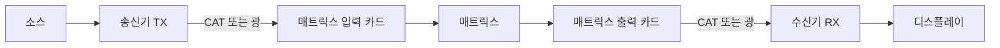

# RTCOM Matrix 구성기 개발 계획: XDM · SPX · VDM + 전송기

작성일: 2026-09-18  
상태: 제품 자료 검토를 반영한 설계 제안. 구현·배포 완료 문서가 아니다.  
범위 근거: 사용자의 Matrix 카테고리, XDM/SPX/VDM 세 제품군, 전송기 동시 조합 요청.  
원본 기획: [Master Plan](AI-DLC_RTCOM_Matrix_IO_Configurator_Master_Plan.md)  
제품 근거와 미확인 사항: [Evidence & Data Gaps](evidence/RTCOM_MATRIX_EVIDENCE_AND_GAPS.md)

## 1. 목표와 범위

하나의 프로젝트에서 매트릭스 섀시, 입출력 카드, 외부 송수신기, 연결 케이블 조건, 전원 조건을 함께 설계하고 검증하며 통합 BOM을 생성한다.

- 최상위 카테고리는 `매트릭스(Matrix)`로 고정한다.
- 제품군은 `XDM`, `SPX`, `VDM`을 모두 포함한다. UXM과 기타 단품 매트릭스는 이번 범위에서 제외한다.
- 각 제품군에 `메인프레임`, `입력 카드`, `출력 카드`, `전송기`, `필수 부속품` 탐색 그룹을 둔다.
- 전송기는 `송신기(TX)`, `수신기(RX)`, `송수신 전환형`으로 구분한다. 전환형은 설치 인스턴스마다 운용 역할을 선택한다.
- 한 구성은 섀시 한 대를 기준으로 한다. 같은 프로젝트의 비교안은 각각 독립 구성으로 저장한다. 여러 매트릭스 간 연결·캐스케이드는 후속 범위다.
- 장비 실시간 제어, 가격·재고, 계정, ERP 연동은 포함하지 않는다.
- 이번 산출물은 설계 및 개발 순서다. 제품 전체의 생산 카탈로그 등록이나 PHASE 0 Release Gate 통과를 선언하지 않는다.

기존 문서와 충돌하는 경우 이번 요청의 세 제품군 범위와 본 문서의 전송기 연결 설계를 우선한다. 원본 문서는 이력 보존을 위해 수정하지 않았다.

## 2. 권장 접근

| 접근 | 장점 | 한계 | 선택 |
|---|---|---|---|
| 공통 구성 엔진 + 제품군별 데이터 + 포트별 전송기 연결 | 검증·저장·BOM을 공유하고 제품별 제약을 표현 | 초기 데이터 계약을 정확히 설계해야 함 | 권장 |
| 제품군별 별도 구성기 3개 | 각 화면을 개별 제작하기 쉬움 | 같은 수정·테스트를 반복하고 결과가 달라질 위험 | 채택하지 않음 |
| 슬롯 구성기에 전송기 수량만 추가 | 최초 UI 구현이 단순함 | 연결 방향·거리·중복·급전 검증 불가능 | 예비품 추가에만 제한 사용 |

세 제품군을 처음부터 데이터 모델과 메뉴에 포함한다. 기능 개발은 공통 엔진을 만든 후 XDM의 명시된 연결 관계로 검증하고, SPX와 VDM의 예외를 추가하는 순서로 진행한다. 이는 제품군 범위를 한 종류로 축소한다는 뜻이 아니다.

## 3. 카테고리와 화면 구조

```text
매트릭스
├─ XDM
│  ├─ 메인프레임 / 입력 카드 / 출력 카드
│  └─ 전송기: CAT · 광 / TX · RX · 전환형 / 박스형 · 벽부형
├─ SPX
│  ├─ 메인프레임 / 입력 카드 / 출력 카드
│  └─ 전송기: CAT / TX · RX
└─ VDM
   ├─ 메인프레임 / 입력 카드 / 출력 카드
   └─ 전송기: CAT · 광 / TX · RX / 박스형 · 벽부형
```

위 구조는 탐색 분류다. 같은 제품군에 속한다는 이유만으로 상호 호환을 인정하지 않는다. 제품 카탈로그는 하나로 관리하고 그룹에서는 참조한다. 특히 전환형 제품을 TX용 SKU와 RX용 SKU로 중복 생성하지 않는다.

기본 작업 흐름은 다음과 같다.

1. **제품군·요구사항:** 입력 소스와 출력 디스플레이 수, 신호 형식, 해상도·프레임레이트·색차, 기능, 설치 위치별 거리 입력. 직접 구성은 요구 입력을 건너뛸 수 있다.
2. **메인프레임:** 섀시 선택. 슬롯 구성이 확인된 모델만 편집 가능하다.
3. **입출력 카드:** 후면 슬롯 선택 후 호환 카드 배치. 카드마다 실제 포트 수를 표시한다.
4. **전송기·배선:** 사용 포트별 TX/RX 연결. 거리·케이블 종류·전원 방식·설치 구역을 함께 입력한다.
5. **검증·BOM:** 물리 설치, 신호 경로, 요구 충족, 급전 상태와 총 수량 검토.
6. **저장·내보내기:** JSON, CSV, 인쇄/PDF. 화면과 출력에 동일한 계산 결과 사용.

중앙 편집기는 `슬롯 보기`와 `전송 연결 보기` 두 탭으로 구성한다. 전송 연결 보기는 초기에는 표로 제공하고 복잡한 자유 배선 캔버스는 도입하지 않는다.

전송 연결 표의 열은 `구역/장비명`, `방향`, `카드·포트`, `연결 방식`, `전송기·역할`, `케이블`, `거리`, `전원`, `검증 결과`다. 동일 조건을 여러 포트에 일괄 적용하되 저장 시에는 포트별 독립 연결로 풀어 기록한다.

## 4. 제품군별 등록 계획

아래 모델명은 제공 PDF에 등장한 조사 목록이다. 목록에 있다는 사실과 특정 섀시에 설치 가능한 사실을 분리한다. PDF 페이지는 파일의 1부터 시작하는 페이지이며 인쇄 페이지 번호와 일치한다.

### XDM: PDF p.4–12

| 구분 | 조사 대상 |
|---|---|
| 메인프레임 | XDM-12, XDM-20, XDM-36, XDM-72, XDM-144, XDM-216, XDM-288 |
| 입력 카드 | XDM-HI100, XDM-HIS100, XDM-DPI100, XDM-CIS100, XDM-FIS100, XDM-SIS100 |
| 출력 카드 | XDM-HOS100, XDM-DPOS100, XDM-COS100, XDM-FOS100, XDM-SOS100, XDM-WOS100 |
| CAT 전송기 | XDM-CTR100, XDM-CTR100 PSE, XDM-CT103, XDM-CR103 |
| 광 전송기 | XDM-FT101, XDM-FR101 |

- p.6–9 카드의 영상 포트는 각 4개로 기재되어 있다. 오디오 포트는 별도 집계한다.
- CAT 경로는 HDBaseT 3.0, 광 경로는 광 타입과 거리 조건을 분리한다.
- CTR100과 CTR100 PSE는 전환형이다. `deviceId`는 같아도 인스턴스의 `operatingRole`은 TX 또는 RX 중 하나다.
- p.7·9의 SDI 카드 최대 모드는 4K60 4:2:2다. 제품군의 4:4:4 소개 문구를 모든 카드에 일괄 적용하지 않는다.
- XDM-288은 p.4 라인업에는 있지만 p.5 채널·크기 표에는 없다. 모델 존재 근거만 기록하고 상세 구성은 확인 대기한다.

### SPX: PDF p.13–16

| 구분 | 조사 대상 |
|---|---|
| 메인프레임 | SPX-M810, SPX-M1620, SPX-M3236, SPX-M2472, SPX-M24120 |
| 입력 카드 | SPX-HIS8: HDMI 입력 8개 |
| 출력 카드 | SPX-HOS10: HDMI 10개, SPX-HOS12: HDMI 12개, SPX-COS12: CATx 12개 |
| 전송기 | SPX-RX, SPX-TX. 원문 통합 표기는 SPX-RX/TX이며 별도 판매 SKU 확인 필요 |

- `SPX-COS12 → SPX-RX`는 p.16에 명시되어 있다.
- p.15의 CAT6 조건은 4K60 50m, 1080p 60m다. 실제 경로에서는 연결 장비·모드에 해당 조건이 적용되는지 함께 확인한다.
- SPX의 CATx를 HDBaseT로 임의 변환하거나 XDM/VDM CAT 제품과 호환된다고 판단하지 않는다.
- p.16에 CAT 입력 설명은 있으나 구체적인 CAT 입력 카드 모델·스펙은 없다. SPX-TX의 매트릭스 입력 카드 직결은 확인 대기다.
- SPX-TX도 전송기 그룹과 데이터 모델에 포함한다. `소스 → SPX-TX → SPX-RX → HDMI 입력 카드` 같은 HDMI 중간 연장 경로는 지원 설계에 포함하되, 실제 TX/RX 조합·역할·급전 증거를 확보한 후 활성화한다.
- SPX-M810의 8×10 소개만으로 12포트 출력 카드의 설치 가능 여부를 추정하지 않는다. 프레임별 HOS10/HOS12/COS12 허용표가 필요하다.

### VDM: PDF p.17–27

| 구분 | 조사 대상 |
|---|---|
| 메인프레임 | VDM-8X, VDM-16X, VDM-32X, VDM-48X, VDM-64X, VDM-80X, VDM-128X, VDM-180X, VDM-288X |
| 입력 카드 | HIS4-U, CIS4-U, FIS4-U, SIS4-U |
| 출력 카드 | HOS4-U, HOS4S-UW, QOS4S-U, COS4-U, FOS4-U, SOS4 |
| CAT 송신기 | CT101-U, CT102-U, CT103-U-H, CT104-U |
| CAT 수신기 | CR101-U, CR102-U, CR103-U, CR104-U |
| 광 송신기 | FT101-U, FT102-U, FT103-U-H |
| 광 수신기 | FR101-U, FR102-U, FR103-U |

- 출력 카드 `QOS4S-U`는 p.20 기준 HDMI 출력 2개다. 제품군의 '슬롯당 4포트' 일반 설명보다 개별 카드 사양을 사용한다.
- SIS4-U와 SOS4는 p.19–20 기준 최대 1080p60이므로 VDM 전체에 4K를 부여하지 않는다.
- `CIS4-U ← CAT TX`, `COS4-U → CAT RX`, `FIS4-U ← 광 TX`, `FOS4-U → 광 RX`는 검증해야 할 연결 후보군이다. 해당 페이지에 구체적 카드-전송기 허용표는 없어 자동으로 확정하지 않는다.
- p.25 FR101-U 표의 HDBaseT 입력 표기와 광 수신기 본문, p.26–27 수신기 입력란의 Optical Output 표기는 충돌 상태로 기록한다.
- Scaling·Seamless·Wall·Quad View는 개별 카드/전송기의 기능으로 관리한다. 모든 VDM 조합이 모든 기능을 지원한다고 표시하지 않는다.

## 5. 전송기 조합 방식

### 5.1 매트릭스 전송 카드 직결



송신기는 입력 카드 측, 수신기는 출력 카드 측에 배치한다. 이때 매트릭스 전송 카드가 상대측 장비 역할을 하므로 외부 TX와 RX를 무조건 한 쌍씩 추가하지 않는다. 입력과 출력 연결은 서로 독립적이며 수량도 같을 필요가 없다.

현재 직접적인 관계가 명시된 예:

| 경로 | 근거 | 활성화 조건 |
|---|---|---|
| XDM-CTR100(TX) → XDM-CIS100 | p.10 | 섀시·카드 설치 조건과 해당 링크의 케이블·급전 조건 확인 |
| XDM-CT103 → XDM-CIS100 | p.11 | 동일 |
| XDM-COS100 → XDM-CTR100(RX) | p.10 | 동일 |
| XDM-COS100 → XDM-CR103 | p.11 | 동일 |
| XDM-FT101 → XDM-FIS100 | p.12 | 섀시·카드, 광 타입·거리·전원 확인 |
| XDM-FOS100 → XDM-FR101 | p.12 | 동일 |
| SPX-COS12 → SPX-RX | p.16 | 프레임별 카드 허용·포트 사용·급전 조건과 판매 SKU 확인 |

XDM-CTR100 PSE와 CTR100 및 CT103/CR103 간 사용 관계는 p.10–11에 있다. PSE 모델의 매트릭스 카드 직결은 일반 CTR100의 허용 규칙을 그대로 복사하지 않고 별도 확인한다.

### 5.2 HDMI 포트에서 TX/RX 쌍으로 연장

전송 카드 직결 외에 `소스 → TX → RX → HDMI 입력 카드`, `HDMI 출력 카드 → TX → RX → 디스플레이` 경로를 모델링한다. 이 경우 외부 TX와 RX를 각각 한 대씩 집계한다. 실제 선택은 확인된 장비 쌍과 신호 프로파일만 허용한다.

이 방식은 세 제품군에 공통으로 적용할 수 있는 구조다. 동일 커넥터나 제품군 소속만으로 경로를 허용하지 않는다. 첫 출시는 카드 직결을 우선하고, 확인된 HDMI 연장 쌍을 같은 전송기 단계에 추가한다.

### 5.3 수량과 편집 정책

- 카드 설치 용량, 실제 연결된 포트, 예비 포트를 각각 표시한다.
- 4포트 전송 카드에 실제 연결 3개면 전송기 3대가 기본값이다. 네 번째 포트는 예비이며 RX/TX 한 대를 강제로 추가하지 않는다.
- 같은 SKU가 여러 포트에 있어도 각 실물 장비는 별도 인스턴스 ID를 갖는다.
- 예비 전송기는 `예비품`으로 별도 추가하며 연결 용량과 요구 충족 계산에는 포함하지 않는다.
- 카드 교체로 기존 연결이 불가능해지면 영향을 받는 연결을 표시하고 미연결 상태로 보존한다. 장비를 조용히 삭제하거나 다른 포트로 재배정하지 않는다.
- Undo/Redo는 카드와 관련 연결·장비·전원 변경을 한 작업 단위로 복원한다.
- 미사용 예비 포트는 정상이다. 사용한다고 지정한 원격 경로의 전송기 누락은 완료 오류다.

## 6. 데이터 계약

| 엔터티 | 필수 정보 / 책임 |
|---|---|
| Category / ProductFamily | Matrix 및 XDM/SPX/VDM 식별자와 탐색 그룹 |
| Chassis | 모델명, 판매 SKU, 슬롯 정의, 허용 카드, 물리 layout, 기본 포함품 |
| Card | 방향, 점유 슬롯, 포트 그룹, 기능, 모드별 자원 제약 |
| PortDefinition | 커넥터, 신호 프로토콜, 방향, 동시 사용 그룹, 개수, 지원 프로파일 |
| Extender | 모델, 판매 SKU, TX/RX 가능 역할, 포트, 박스/벽부 형태, 전원 능력 |
| LinkCompatibility | 양 끝 제품·포트·운용 역할, 허용 프로파일, 케이블·거리·급전 조건, 증거 |
| SignalProfile | 가로/세로 픽셀, Hz, 색차, 색심도, HDCP, 필요한 경우 압축 방식 |
| CableProfile | CAT 종류/검증된 제품, 광 SM/MM·단자·가닥 수, 조건별 최대 거리 |
| DeviceInstance | 실물 한 대의 ID, extenderId, operatingRole, 설치 구역, 전원 선택 |
| Connection | 양 끝 포트 참조, cableProfileId, lengthMeters, requirementId |
| SignalPath | 입력 또는 출력의 전체 연결 경로, 변환 단계, 적용 요구사항 |
| Accessory / SupplyItem | 전원·필러·부속품, 기본 포함/추가 구매/현장 제공/예비품 구분 |
| EvidenceClaim | 문서·페이지·필드/관계·상태·검토일·상충하는 근거 |

`Configuration`은 `schemaVersion`, `catalogVersion`, 섀시 선택, 카드 placements, extenderInstances, connections, signalPaths, accessories, requirements, 경고 확인, 제목·메모를 저장한다.

포트 참조는 단순 화면 순번 대신 `ownerInstanceId + portGroupId + portIndex`로 식별한다. 카드 인스턴스는 물리 slotId와 연결하고 송수신기도 동일한 포트 참조 계약을 쓴다. 다중 슬롯 카드는 하나의 설치 인스턴스와 점유 범위로 기록한다.

해상도는 숫자 프로파일 집합으로 비교한다. 모든 장치가 공통 모드를 지원하는지 확인하며 스케일러가 있는 경로는 입력 프로파일과 출력 프로파일을 명시적으로 변환한다. 최솟값 하나로 경로를 판정하지 않는다. 확정되지 않은 변환은 지원으로 간주하지 않는다.

모델명과 주문용 SKU는 분리한다. SPX-RX/TX처럼 합쳐 표기된 이름을 실제 주문 SKU로 임의 생성하지 않는다. sourceRef와 확인 상태는 제품 전체뿐 아니라 호환 관계·거리·급전·프로파일별로 둔다.

## 7. 검증 정책

검증은 `설치 유효성`, `경로 유효성`, `요구 충족`, `근거 완전성`을 별도로 계산한 뒤 최종 완료 상태를 만든다.

| 규칙 | 차단 또는 표시할 사례 |
|---|---|
| 슬롯/카드 | 입력 슬롯에 출력 카드, 중복 설치, 허용 모델 아님, 점유 범위 겹침 |
| 방향/운용 역할 | 입력 전송 카드에 RX 연결, CTR100 역할 미선택, 한 장비의 TX/RX 동시 점유 |
| 프로토콜/호환표 | SPX CATx와 XDM HDBaseT를 RJ45라는 이유로 연결 |
| 포트 배정 | 포트 하나에 장비 두 대, 없는 포트 번호, 삭제된 카드 참조 |
| 전송 성능 | 개별 카드·전송기·케이블이 요구 신호를 지원하지 않음 |
| 거리 | 해당 신호·케이블에 대해 확인된 최대 길이를 초과 |
| 급전 | 원격 급전이 필요한 장비에 공급원 없음, 확인되지 않은 PSE/PD 또는 POC 조합 |
| 전력/대역폭 | 확인된 예산 초과. 데이터가 없으면 무제한으로 간주하지 않음 |
| 요구 충족 | 필수 소스·디스플레이·기능·원격 경로 누락 |
| 버전/출처 | 오래된 카탈로그, 미확인 필수 조건, 서로 충돌하는 사양 |

카탈로그에서 POE/POC/PSE/PD 표기는 원문과 함께 보존한다. 이를 같은 표준으로 취급하지 않으며 포트별 공급 방향과 조합별 허용 조건을 따로 검증한다. 원격 급전이 확인되면 전원 어댑터를 무조건 추가하지 않는다. 현장 제공 전원은 구매 BOM과 구분하되 완료 조건에는 반영한다.

미확인 관계는 '비호환 확정'과 구분해 `호환성 확인 필요`로 표시한다. 제품 소개·탐색에서는 확인된 설명만 노출할 수 있지만, 생산 구성에서 미확인 필수 조건을 가진 조합의 선택·확정 내보내기는 허용하지 않는다. 개발용 가상 fixture는 생산 데이터와 분리한다.

Draft는 오류가 있어도 자동 저장한다. 사용자가 공유하는 완료 JSON/CSV/PDF는 동일한 최종 검증을 통과해야 한다. 백업용 Draft JSON을 제공할 경우 미완료 상태를 명시하고 BOM/완성본으로 취급하지 않는다. 경고 확인은 현재 경고 ID와 관련 구성 내용에 묶어 저장하여 구성 변경 후 과거 확인을 재사용하지 않는다.

## 8. BOM과 출력

BOM 그룹은 `메인프레임`, `입력 카드`, `출력 카드`, `송신기`, `수신기`, `전원·필수 부속품`, `케이블`, `예비품`이다.

- 같은 판매 SKU는 구매 BOM에서 합산한다. 전환형의 TX/RX 역할별 내역은 설치표에서 별도로 보여준다.
- 송수신기 수량은 연결 수가 아니라 중복 없는 실물 인스턴스로 집계한다.
- 프레임 기본 포함 전원·팬 등은 포함품으로 표기하고 추가 구매 수량에 중복 가산하지 않는다.
- 케이블의 검증 규격과 실제 주문 SKU를 분리한다. SKU가 없으면 배선표의 규격·길이 항목으로 출력하고 임의의 상품 번호를 만들지 않는다.
- PDF에는 후면 슬롯 배치, 포트별 연결표, 전송기 설치 위치·역할, 케이블 거리, 전원 조건, BOM, 경고, 카탈로그/스키마 버전을 담는다.
- JSON에는 연결·역할·급전 선택까지 보존한다. 예전 카탈로그 파일을 함께 보존하여 재현성을 확보한다.

수량 검증 예: XDM-COS100 한 장의 4개 포트 중 3개를 XDM-CR103으로 연결했다면 출력 카드 1장과 수신기 3대, 연결 3개, 예비 포트 1개다. 이 예는 p.8·11의 포트 수와 연결 관계를 사용한 단위 시나리오이며, 특정 섀시를 포함한 설치 승인 사례는 아니다.

## 9. 구현 구조

기존 앱이 없으므로 이전 기획의 React + TypeScript + Vite 기본안을 유지한다. 패키지 버전은 실제 구현 시작 시 확인한다. 정적 웹앱, reducer 기반 편집 상태, Zod 데이터 검증, Vitest 단위 검증, Playwright 주요 흐름 검증, 인쇄 HTML/CSS가 기본이다.

```text
src/
  catalog/
    schemas/                  제품·포트·연결·증거 계약
    loader.ts                 버전 선택 및 검증된 카탈로그 로드
    data/{xdm,spx,vdm}/       프레임·카드·전송기·명시적 허용 관계
  domain/
    placements/               슬롯 설치와 점유 계산
    connections/              전송기 배치·포트 배정·경로 구성
    validation/               슬롯·링크·급전·요구조건 검증
    capacity/                 설치/연결/예비 용량 계산
    recommendation/           프레임·카드·전송기 후보 탐색
    bom/                      실물 인스턴스와 포함품 기반 집계
  features/
    family-picker/
    requirements/
    chassis-editor/
    extender-editor/
    validation-summary/
    export/
  persistence/                Draft·JSON·버전 migration
  test-fixtures/              명확하게 가상으로 표시된 테스트 제품
scripts/
  validate-catalog/            참조·SKU·출처·필수 데이터 검사
```

domain은 React에 의존하지 않는다. 검증·용량·BOM은 구성과 카탈로그에서 계산하며 별도 편집 상태로 저장하지 않는다. UI, import, 추천, export는 같은 validator를 사용한다.

## 10. 단계별 개발 및 통과 조건

아래는 설계 로드맵이다. 제품별 설치 조건 확정 후 각 단계의 상세 구현 작업과 테스트 코드를 작성한다. 현 단계에서 모르는 제품 수치를 구현 예제로 채우지 않는다.

| 단계 | 작업·주요 파일 영역 | 통과 조건 |
|---|---|---|
| 0. 데이터 확정 | evidence 문서, 세 제품군의 프레임/카드/전송기 허용표 | 출시 대상 각 제품군에 최소 한 섀시의 물리 슬롯·카드 허용·연결 경로·필수품 확인 |
| 1. 카탈로그 계약 | catalog/schemas, loader, validate-catalog | 세 제품군 공통 스키마, 참조 오류·중복·미확인 필수 데이터 배포 차단 |
| 2. 슬롯 및 링크 엔진 | placements, connections, validation, capacity | XDM 역할 전환, SPX CAT 별도 규격, VDM 2포트 예외와 연결 검증 통과 |
| 3. 매트릭스 편집 UI | family-picker, requirements, chassis-editor | 세 제품군 탐색·섀시 선택·카드 편집·키보드 조작·Draft 복구 |
| 4. 전송기 편집 UI | extender-editor, validation-summary | 포트별 TX/RX·거리·급전, 일괄 배치, 카드 교체 영향, Undo/Redo |
| 5. BOM·저장·출력 | bom, persistence, export | 연결 포함 JSON 왕복 동일, SKU·인스턴스 수량 일치, PDF 한글·표 정상 |
| 6. 자동 추천 | recommendation | 요구량·거리·형태·신호·전원을 만족하는 검증된 완성 후보 제안 |
| 7. 출시 검증 | 단위·E2E·인쇄·카탈로그 CI | 세 제품군 각각 정상 연결 사례 통과, 오류 출력 차단, P0/P1 결함 없음 |

자료 확정은 항목별로 진행한다. 확인이 늦는 특정 모델 때문에 공통 설계·테스트 fixture 작업 전체를 막지 않지만, 미확인 모델을 출시된 지원 모델처럼 표시하지 않는다. 문서 기본 GUIDED 모드는 실제 구현 시 단계별 결과 검토에 적용한다.

내부 시험 순서는 XDM의 명시적 CAT 연결 → XDM 광 연결 → SPX 출력 CAT/RX → VDM의 확인된 CAT/광 연결 → 확인된 HDMI 연장 쌍이다. 정식 세 제품군 출시는 각 제품군의 설치·전송 경로 통과 조건을 모두 충족해야 한다.

### 자동 추천 범위

- 입력값: 소스/디스플레이 수, 해상도, 신호, 원격 거리, CAT/광, 벽부 여부, 필수 기능, 전원 제공, 예비율.
- 순서: 부적합 프레임 제거 → 카드 조합 → 연결 장비·역할·케이블·급전 결정 → 전체 검증 → 목표별 순위.
- 최초 목표: 요구를 만족하는 구성 한 개. 이후 작은 프레임, 적은 카드/장비, 확장 여유 기준 상위 3개.
- 가격 자료가 없으므로 '최저가'라고 표시하지 않는다.
- 탐색 시간/노드 제한을 두고 필요 시 Worker를 사용한다. 결과 상태는 FOUND, NO_SOLUTION, SEARCH_LIMIT_REACHED, INSUFFICIENT_DATA로 구분한다.
- 탐색 시간 초과나 자료 부족을 '불가능한 구성'으로 단정하지 않는다.

## 11. 핵심 검증 시나리오

| 번호 | 시나리오 | 기대 결과 |
|---|---|---|
| T01 | CTR100을 TX로 CIS100에 연결 | p.10 관계를 인식. 전체 유효성은 케이블·전원·섀시 증거까지 검증 |
| T02 | 같은 CTR100을 RX로 바꾸고 입력 연결 유지 | 방향 오류, 완료 출력 차단 |
| T03 | COS100 한 장의 사용 포트 3개에 CR103 각각 연결 | 수신기 3대, 연결 3개, 예비 포트 1개 |
| T04 | 설치된 4포트 카드의 같은 포트에 장비 두 대 배정 | 중복 연결 차단 |
| T05 | XDM 광 경로에 MM 300m/301m 적용 | p.7·9·12 조건에서 거리 검사 각각 통과/실패. 나머지 조건은 별도 검증 |
| T06 | SPX-COS12에 XDM-CR103 자동 조합 시도 | 확인된 허용 관계 없음으로 제안하지 않음 |
| T07 | SPX CAT 입력 카드의 SKU 없이 TX 직결 요청 | 자료 부족으로 표시, 가상 카드를 만들지 않음 |
| T08 | VDM QOS4S-U의 출력 용량 계산 | 2개. 카드명 숫자나 시리즈 일반 문구로 4개를 계산하지 않음 |
| T09 | VDM SIS4-U가 포함된 경로에 4K 요구 | 개별 카드 성능 미충족 표시 |
| T10 | FR101-U의 상충하는 입력 프로토콜로 카탈로그 승인 시도 | 해결 근거가 없으면 배포 차단 |
| T11 | 전환형 같은 SKU를 TX 2대·RX 3대로 설치 | 구매 수량 5대, 설치표 역할별 2/3 구분 |
| T12 | 외부 TX/RX가 각각 필요한 HDMI 연장 경로 | 두 실물 장비를 집계하고 매트릭스 포트 용량은 1개만 사용 |
| T13 | 카드 교체 후 전송기 연결을 Undo | 카드·인스턴스·포트 연결·전원 상태 동시 복원 |
| T14 | 연결된 수신기 3대 + 예비품 1대 | 구매 4대, 실제 연결 3대. 예비품은 요구 충족에 포함하지 않음 |
| T15 | JSON 저장 후 재불러오기 | 역할·거리·배선·구역·BOM 동일. 비본질적 저장 시각은 해시 비교에서 제외 |
| T16 | 오래된 카탈로그의 구성 불러오기 | STALE 표시 후 명시적 재검증. 지원하지 않는 schemaVersion은 안내 후 거부 |
| T17 | 잘못된 ID·과대 JSON·미래 스키마·CSV 수식 문자열 | 입력 제한·안전한 거부/escape. 부분 적용으로 구성 손상 없음 |
| T18 | 키보드만으로 포트 선택·전송기 추가·제거·출력 | 포커스 복구와 오류 위치 이동, 화면/PDF 수량 일치 |

테스트 fixture는 로직의 정합성을 검증하고, 실제품 사례는 출처가 있는 규칙을 검증한다. fixture 테스트 통과를 실제품 호환성 확인으로 대체하지 않는다.

## 12. 지금 확정할 수 있는 것과 다음 입력

확정 가능한 설계: Matrix 아래 세 제품군, 공통 엔진, 제품군별 전송기 그룹, TX/RX 역할, 포트별 연결, 통합 BOM, 거리·급전 검증, 데이터 버전 보존.

다음 입력은 [근거 문서의 Data Gaps](evidence/RTCOM_MATRIX_EVIDENCE_AND_GAPS.md)에 구체적으로 정리했다. 우선순위는 (1) 프레임별 후면 슬롯/카드 허용표, (2) SPX-TX 대응 입력 경로와 SPX 출력 카드별 프레임 제한, (3) VDM 카드-전송기 호환표와 광 수신기 사양 정정, (4) 전원·필러 등 기본 포함품과 판매 SKU다.

첫 개발 결과는 세 제품군의 메뉴를 갖춘 공통 구성기이며, 확인된 섀시·카드·전송기 경로만 활성화한다. 최종 범위는 세 제품군 모두에서 매트릭스와 전송기를 조합해 저장·검증·출력하는 것이다.
